# TopDisc on AWS: run `aws-five-1k`

## Summary

- **Fleet.** 858 on-demand instances in four regions, the most the per-region vCPU quotas allow. Every node ran to the end and every trace arrived. No host dropped a packet. Node CPU was 0 % at the median and 6 % at the peak.
- **Registration.** Every advertiser reached 30 to 41 registrars, 34 at the median. The quoted wait was 16 s at the median. A registration took about a minute. Ads held peaked at 402 per registrar against a cache of 5 000.
- **Search.** Every searcher found every registrant of its topic. Time to recall grows with topic size. The 392-member topic reached 99 % in 33 s at the median, the 69-member topic in 6 s.
- **Load.** The busiest registrar answered 3.9 times the median, 7 496 queries against 1 902. Traffic per node was 13 MB at the median and 47 MB at the most. Per-node load is the same as in the 540-node run of the same morning once normalised by run length.
- **Re-walk.** On the two large topics searchers kept walking their tables after they had found everything, 11 passes on topic 0 with a third of the results filtered. This loop sets the registrar load on large topics over a long run.

| topic | registrants | t50 (s) | t90 (s) | t99 (s) | queries per search, median |
|---|---|---|---|---|---|
| 0 | 392 | 3.9 | 14.9 | 32.8 | 288 |
| 1 | 190 | 2.0 | 7.2 | 15.9 | 136 |
| 2 | 123 | 1.6 | 5.0 | 9.4 | 77 |
| 3 | 79 | 1.3 | 3.6 | 7.4 | 47 |
| 4 | 69 | 1.1 | 3.2 | 6.3 | 41 |

Medians over searchers of the time to find 50 %, 90 % and 99 % of the registrants of the topic, measured from the start of each searcher.

## Scenario

858 real TopDisc nodes on AWS, one per on-demand t4g.nano instance, over us-east-1, us-west-2, eu-central-1 and ap-southeast-1. Five Zipf topics. Every node registers one topic and searches it continuously, with no target count and the connection model off, for 51 minutes. Nodes start over 3 minutes, registration starts at +1 min, search at +9 min, and the run stops at +60 min. The searcher is the adaptive search distance with yield floor 4. The fork is `github.com/datahop/go-ethereum@v1.17.2-testbed.9`. There is no churn. Protocol defaults apply: ad lifetime 15 min, cache 5 000 ads, 10 buckets, K_register 5, K_lookup 16.

### Topic assignment

| topic | nodes | share |
|---:|---:|---:|
| 0 | 393 | 45.8% |
| 1 | 191 | 22.3% |
| 2 | 124 | 14.5% |
| 3 | 80 | 9.3% |
| 4 | 70 | 8.2% |

## Correctness checks

Functional assertions over the traces of the run, from `checks.py`. Verdicts and evidence are in `checks.json`. *not-exercised* means the run never reached the condition. *needs-data* means the traces lack a field the check needs. The later fork tag testbed.10 writes those fields.

19 pass, 6 not-exercised, 6 needs-data, 1 unit-test.

| check | assertion | status | evidence |
|---|---|---|---|
| **C1** registration | capacity: ads held never exceed the cache size | pass | peak 402 of 5000 per node |
| **C2** registration | no duplicates: one ad per advertiser and topic per registrar | pass | one ad per advertiser and topic in every final ad set |
| **C3** registration | only registrants: every held ad is from a node registering that topic | pass | 0 ads from nodes not registering that topic; 0 ads from ids without a trace |
| **C4** registration | only capable nodes: no legacy node in any cache | not-exercised | no legacy nodes in the run |
| **C5** registration | no self-ads: a registrar never holds its own ad | pass | no registrar holds its own ad |
| **K1** registration | departed nodes leave caches within an ad lifetime | not-exercised | no churn in the run |
| **E1** registration | lifetime: no ad held longer than a lifetime without re-admission | needs-data | per-ad removal time is not traced |
| **E2** registration | renewal keeps fan-out: final fan-out against the post-register level | pass | final fan-out is 1.00× the post-register level at the median; every advertiser above 50% |
| **E3** registration | renewal accounting: renewals sent equal renewals received | pass | renewals: 59076 sent, 59077 received (-0.00%; renewals reuse the session, so none are lost to setup) |
| **W1** registration | bounded wait: no admission after the attempt timeout | pass | longest admitted wait 193 s of 1350 s allowed |
| **W2** registration | no early admission: admitted only after the quoted wait | needs-data | required wait per admission is not traced |
| **W3** registration | lower bound: quotes never undercut earlier ones by more than the time elapsed | needs-data | timed quote sequence per registrar is not traced |
| **W4** registration | full cache admits nothing | not-exercised | no cache reached capacity (peak 402 of 5000) |
| **W5** registration | ticket validity: early, late, wrong-topic and bad-MAC tickets rejected | unit-test | TicketSealer tests in the fork; rejection counters not traced |
| **W6** registration | record address: admitted record IP equals the packet source | needs-data | record IP is not in the ad sets |
| **R1** registration | bucket size: registered plus waiting never exceed the bucket size | pass | registered plus waiting within 5 in every final bucket |
| **R2** registration | bucket IP diversity: one registrar per /24 per bucket | needs-data | registrar ids per bucket are not traced |
| **R3** registration | state maintained: tables complete by search start and no bucket left empty with candidates | pass | 0 final buckets idle with candidates left; 0 of 858 tables not complete by search start |
| **L1** search | right topic: every result registers the requested topic | pass | 0 of 216748 results from nodes not registering the topic; 0 from ids without a trace |
| **L2** search | capable results: no legacy node among results | not-exercised | no legacy nodes in the run |
| **L3** search | no expired results: no result down longer than a lifetime | not-exercised | no churn in the run |
| **L4** search | termination: lookups end at the target or the timeout, hit flag consistent | pass | 858 lookups ended at their target or timeout with a consistent hit flag |
| **L5** search | reply limits: nodes per reply within the topic and aux limits | pass | mean nodes per reply at most 11.4 of 24 (per-search average; exact per-reply counts not traced) |
| **L6** search | no duplicate results within a lookup | pass | every yielded result distinct within its lookup (216748 results) |
| **I1** search | no topic messages to legacy peers | needs-data | destinations of topic requests are not traced |
| **I2** search | base discovery: legacy nodes still find providers | not-exercised | no legacy nodes in the run |
| **A1** load | request accounting: REGTOPIC and TOPICQUERY sent equal received | pass | REGTOPIC and TOPICQUERY: 2526241 sent, 2248415 received (+11.0% first packets before a session); requests unexplained by session setups -0.01% |
| **A2** load | every query answered: TOPICNODES sent at least TOPICQUERY received per node | pass | every node sent at least one TOPICNODES or NODES per TOPICQUERY and FINDNODE received (a query with aux neighbours only is answered with NODES) |
| **A3** load | registrar load bound: busiest registrar within a multiple of the median | pass | busiest registrar at 3.9× the median (7496 vs 1902 queries) |
| **H1** load | no packet drops on any host | pass | no UDP receive-buffer drops on 858 hosts |
| **H2** load | complete collection: a trace for every node | pass | 858 of 858 traces collected |
| **H3** load | hosts under load: node CPU and host memory within limits | pass | node CPU peak 6%, RSS peak 26 MB, host memory never below 251 MB |

## 1. Registration and cache

### Registration coverage after the register-wait phase

```
  topic 0: visible=393  fan-out min=30 med=34 max=41
  topic 1: visible=191  fan-out min=30 med=33 max=37
  topic 2: visible=124  fan-out min=30 med=35 max=40
  topic 3: visible=80  fan-out min=30 med=33 max=40
  topic 4: visible=70  fan-out min=30 med=32 max=38
```

### Registration latency

```
topic             n         mean          std
0               393      92169.0      53389.4
1               191      94165.7      53758.0
2               124      91810.6      53442.7
3                80      86704.6      51790.1
4                70      81598.6      47760.6
```

### 06_fanout_both_views

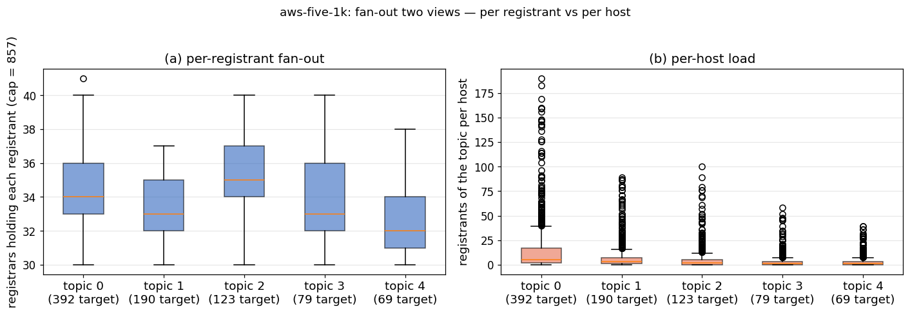

*(a) Registrars holding each registrant's ad; (b) ads held per registrar.*

### 04_id_space_registrants

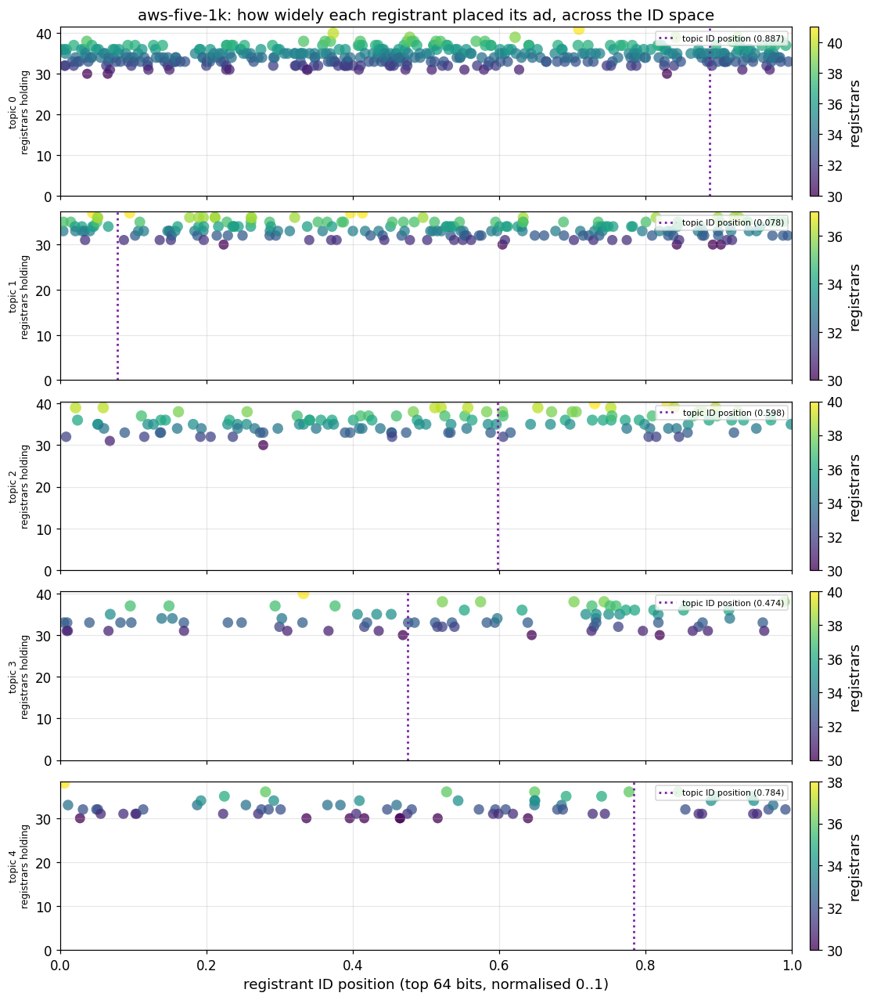

*Fan-out of each registrant across the ID space.*

### 04b_id_space_registrars

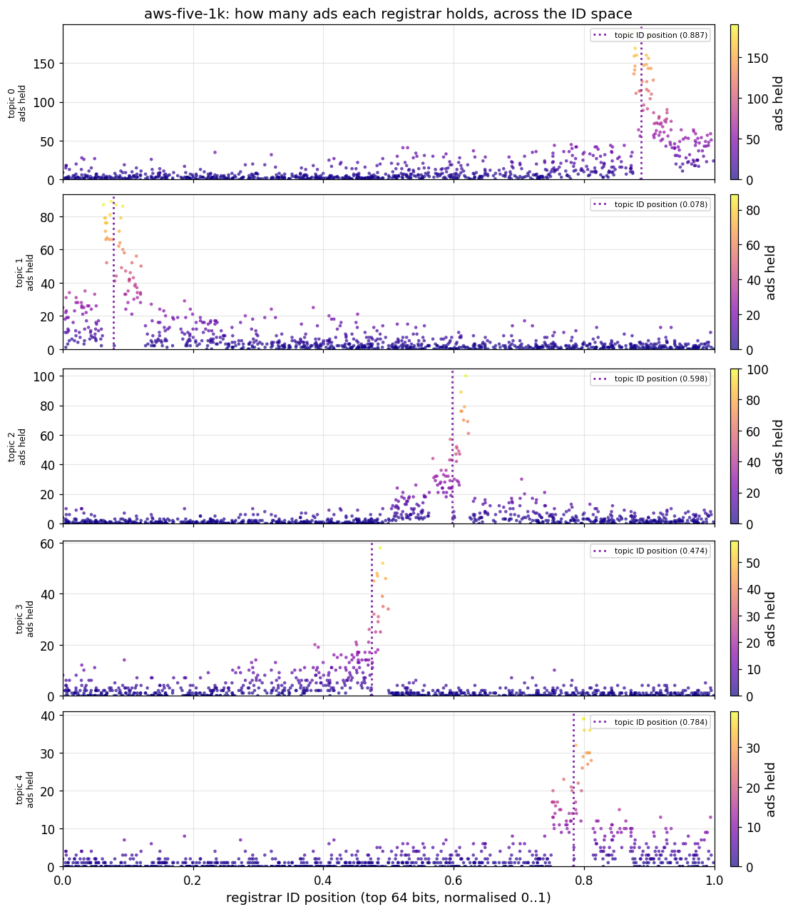

*Ads held by each registrar across the ID space.*

### 07_registration_latency_bar

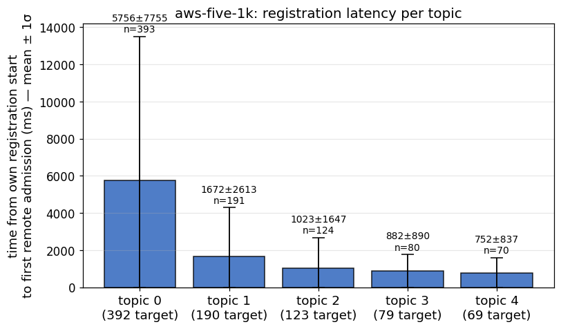

*Mean ± 1σ time to first remote admission per topic.*

### 07_placement_time_idspace

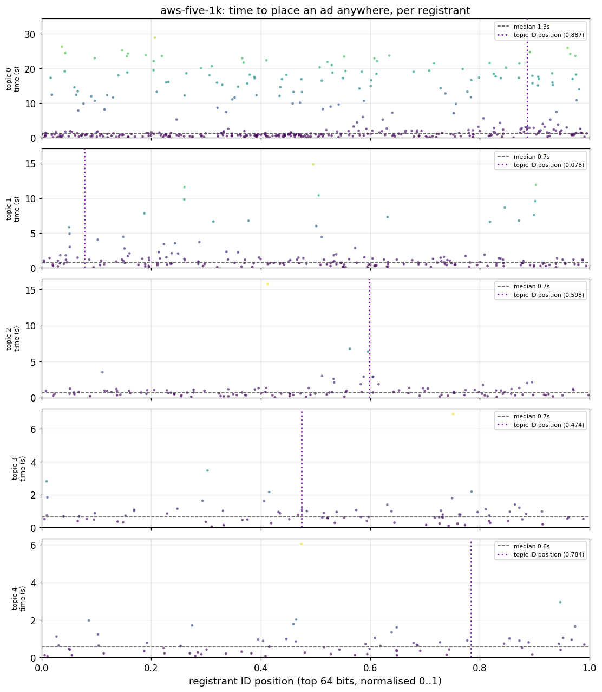

*Time to first admission across the ID space (earliest registrar).*

### oh_05_wait_time_cdf

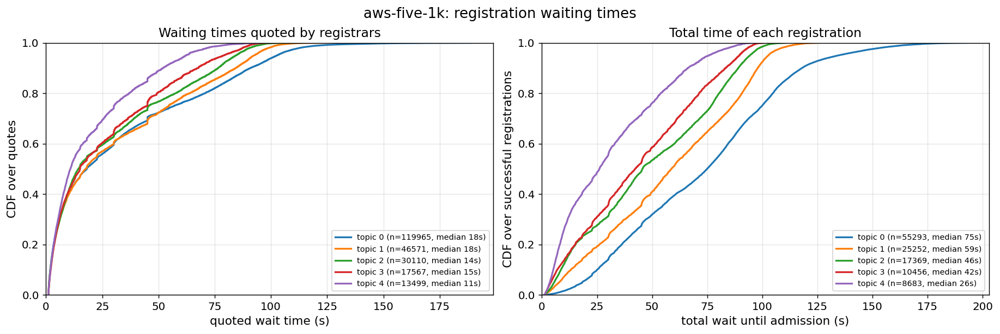

*(a) Waiting times quoted by registrars; (b) total time of every successful registration, from its first REGTOPIC to admission.*

### oh_08_cache_utilisation

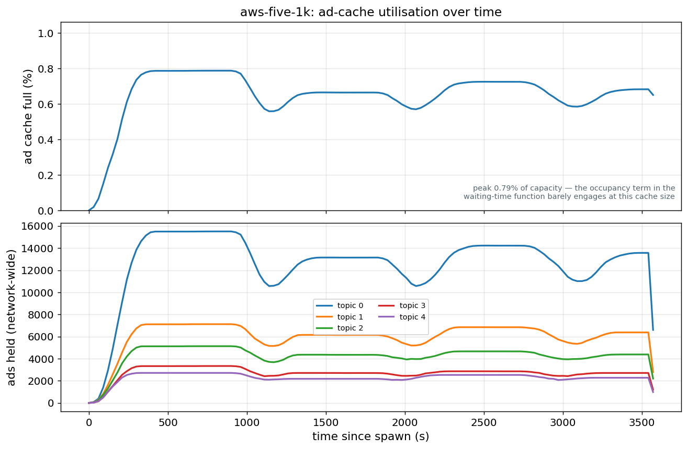

*Ads held network-wide and per topic against cache capacity, over time.*

## 2. Discovery

### Per-topic search results

```
topic     searchers   target   fullRecall   meanRecall   meanUnique
0               393      392      393/393       1.0000        392.0
1               191      190      191/191       1.0000        190.0
2               124      123      124/124       1.0000        123.0
3                80       79        80/80       1.0000         79.0
4                70       69        70/70       1.0000         69.0
```

### How many searchers found each registrant

```
topic   registrants neverFound      min       p5      p25      p50      p75      p95        max
0               393          0      392      392      392      392      392      392      392   mean=392.0
1               191          0      190      190      190      190      190      190      190   mean=190.0
2               124          0      123      123      123      123      123      123      123   mean=123.0
3                80          0       79       79       79       79       79       79       79   mean=79.0
4                70          0       69       69       69       69       69       69       69   mean=69.0
```

### Final coverage

```
topic 0: registrants=393 coveredBy>=1=393 (100.0%) neverFound=0 p50=392 p95=392 max=392
topic 1: registrants=191 coveredBy>=1=191 (100.0%) neverFound=0 p50=190 p95=190 max=190
topic 2: registrants=124 coveredBy>=1=124 (100.0%) neverFound=0 p50=123 p95=123 max=123
topic 3: registrants=80 coveredBy>=1=80 (100.0%) neverFound=0 p50=79 p95=79 max=79
topic 4: registrants=70 coveredBy>=1=70 (100.0%) neverFound=0 p50=69 p95=69 max=69
```

### Search progress

Median per search over the run. `filtered` counts results dropped as recently returned.

| topic | searches | passes | queries | contacted | received | duplicate | filtered | yielded | filtered / received |
|---:|---:|---:|---:|---:|---:|---:|---:|---:|---:|
| 0 | 393 | 11 | 288 | 286 | 2475 | 1382 | 806 | 394 | 33% |
| 1 | 191 | 3 | 136 | 134 | 1091 | 782 | 170 | 190 | 16% |
| 2 | 124 | 1 | 77 | 77 | 619 | 471 | 0 | 123 | 0% |
| 3 | 80 | 1 | 47 | 47 | 380 | 298 | 0 | 79 | 0% |
| 4 | 70 | 1 | 41 | 41 | 308 | 239 | 0 | 69 | 0% |

> **Search re-walk:** on topic 0 searches dropped more results as recently returned than they handed out. With no new registrants left they walk their tables again every pass. The pass back-off removes this loop and is not in this fork.. Query traffic and registrar load on these topics measure that loop.

### 02_recall_reached

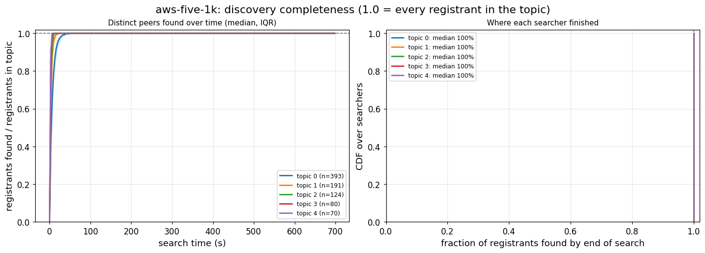

*Distinct registrants found over time and where each searcher finished (1.0 = every registrant of its topic).*

### 03_time_to_fraction

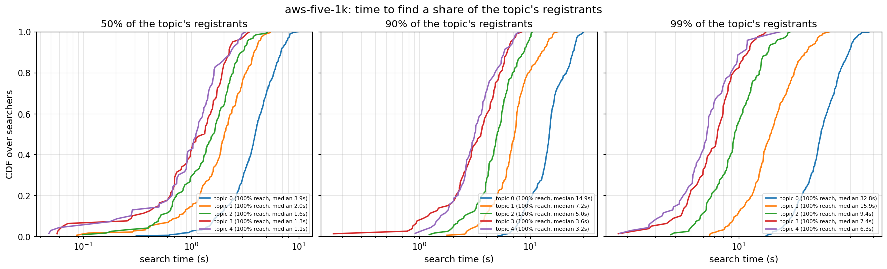

*Time for each searcher to find 50%, 90% and 99% of its topic's registrants.*

### 02b_time_to_first_cdf

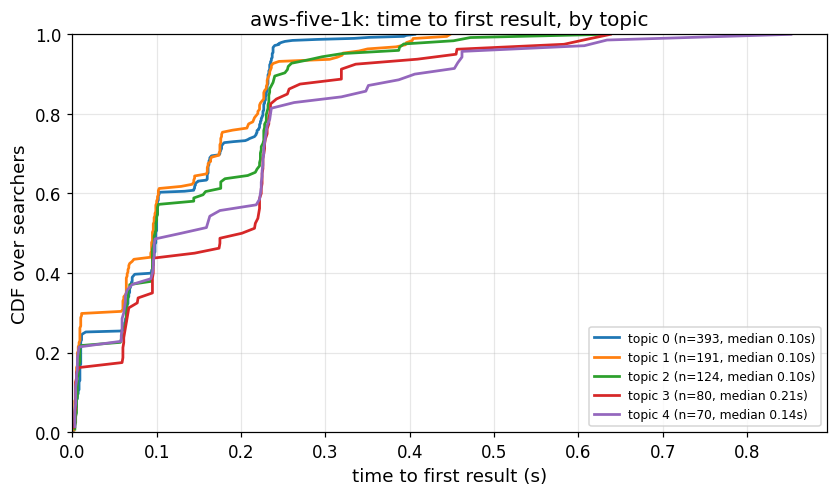

*CDF of time to the first result, per topic, net of the node's scheduled absences when the run wrote churn.json.*

### 08_lookup_latency_cdf

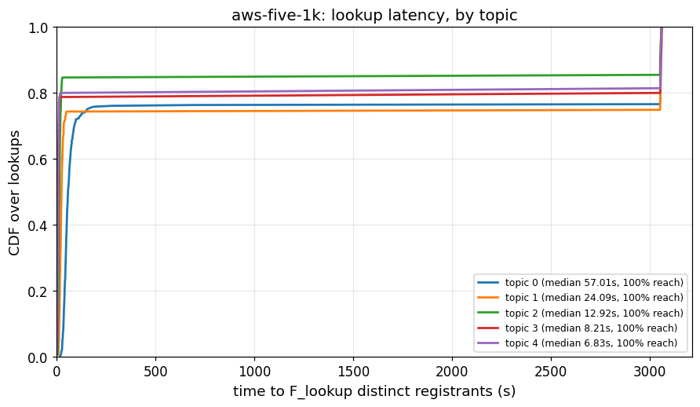

*Lookup latency: time to reach F_lookup distinct registrants, per topic.*

### 09_lookup_contacts_cdf

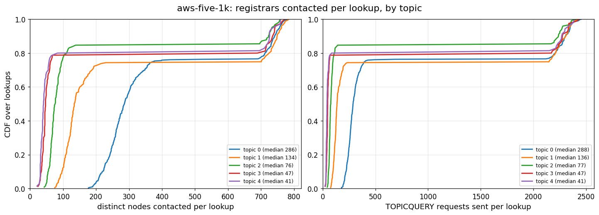

*Registrars contacted per lookup: distinct nodes asked and TOPICQUERY requests sent to reach F_lookup, per topic.*

### 05_id_space_found_vs_missed

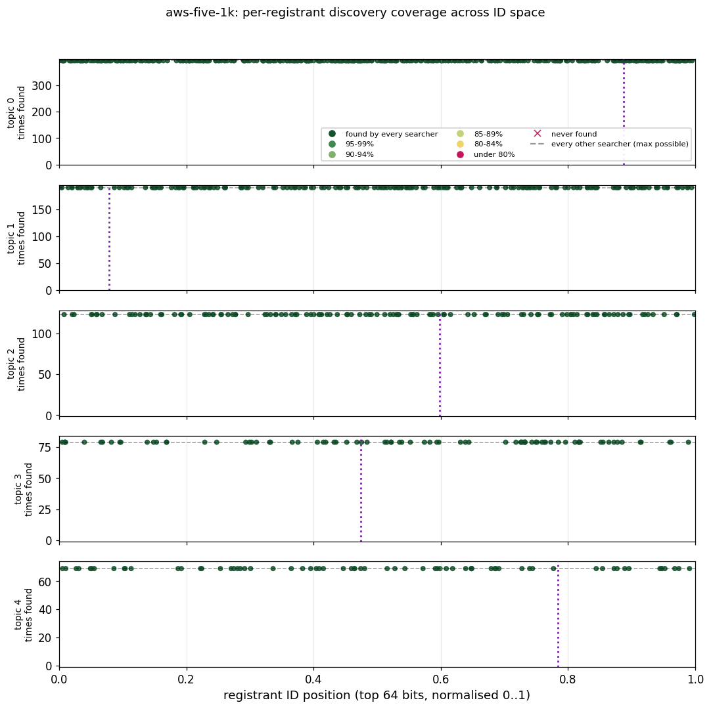

*Share of the other searchers that returned each registrant, across the ID space; registrants online for less than an ad lifetime are hollow.*

### oh_06_idspace_found_time

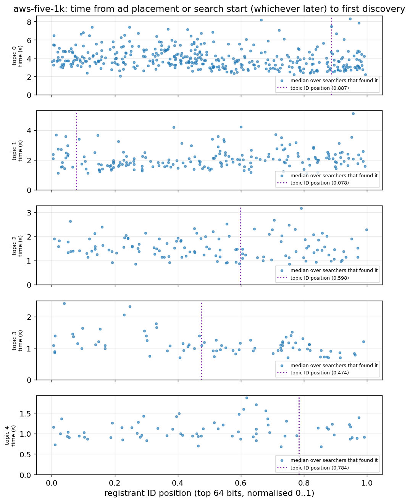

*Time from when an ad could first be found (placed, with searches running) to its first discovery, across the ID space.*

## 3. Overhead and load

### oh_01_idspace_traffic

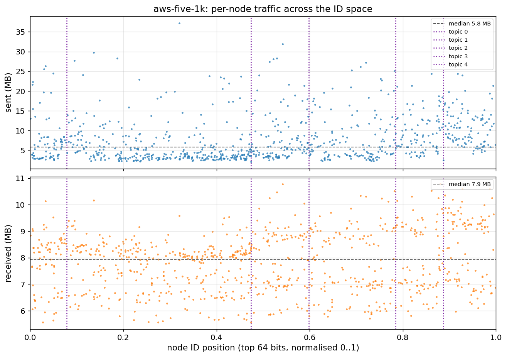

*Messages and bytes sent and received per node, across the ID space.*

### oh_03_idspace_msgtype

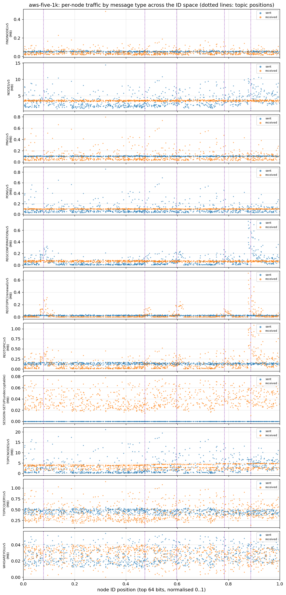

*Per-node traffic by message type, across the ID space.*

### oh_10_reg_vs_lookup

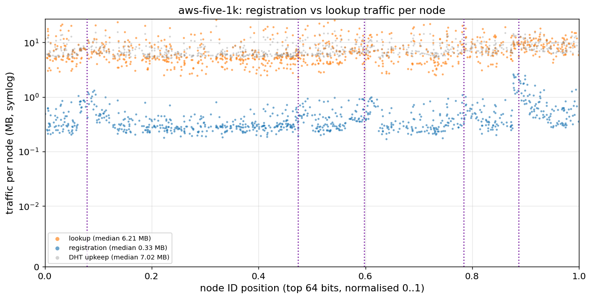

*Registration vs lookup traffic per node.*

### oh_02_idspace_peak_rate

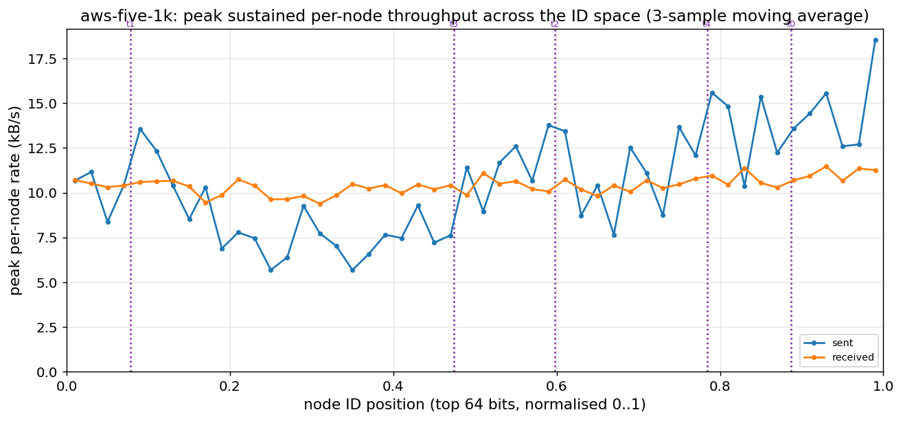

*Peak sustained per-node rate, across the ID space.*

### oh_04_idspace_peak_msgtype

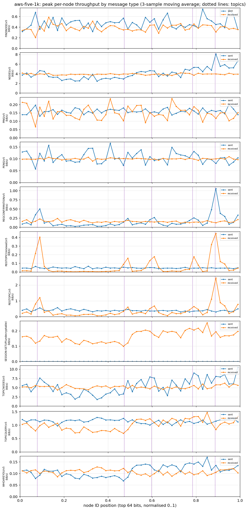

*Peak sustained per-node rate by message type.*

### oh_07_load_vs_topic_distance

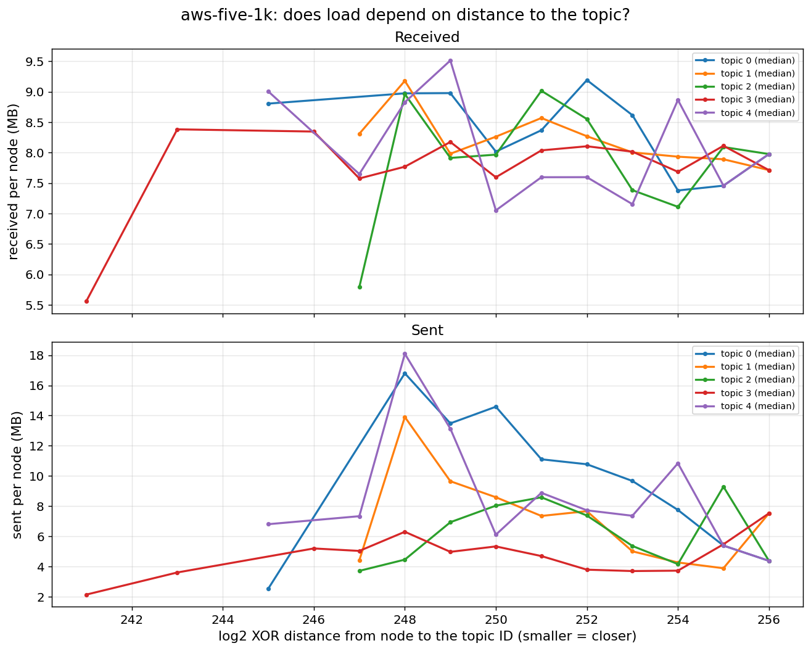

*Median received and sent traffic per node against XOR distance to each topic.*

### oh_09_cost_per_lookup

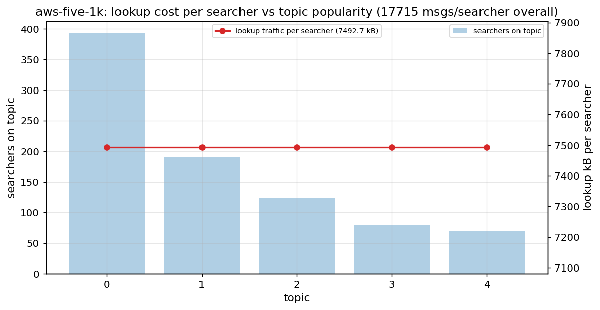

*Lookup traffic per searcher against topic size.*

### oh_11_topic_load

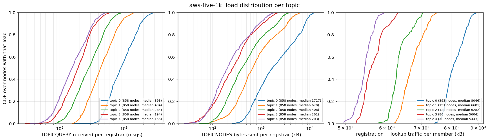

*Load distribution per topic: search requests (TOPICQUERY) received and TOPICNODES bytes sent per registrar, and registration and lookup traffic per member.*

### Load summary

| load | topic | unit | nodes | median | p95 | p99 | max | CV |
|---|---:|---|---:|---:|---:|---:|---:|---:|
| TOPICQUERY received per registrar | 0 | msgs | 858 | 893.0 | 2130.9 | 2653.2 | 3416.0 | 0.52 |
| TOPICQUERY received per registrar | 1 | msgs | 858 | 434.0 | 1013.1 | 1359.6 | 1662.0 | 0.53 |
| TOPICQUERY received per registrar | 2 | msgs | 858 | 284.5 | 671.3 | 830.4 | 1096.0 | 0.55 |
| TOPICQUERY received per registrar | 3 | msgs | 858 | 193.5 | 442.1 | 552.0 | 714.0 | 0.52 |
| TOPICQUERY received per registrar | 4 | msgs | 858 | 155.5 | 387.6 | 484.4 | 608.0 | 0.56 |
| TOPICNODES bytes sent per registrar | 0 | kB | 858 | 1716.9 | 9151.6 | 11444.0 | 14353.4 | 0.95 |
| TOPICNODES bytes sent per registrar | 1 | kB | 858 | 670.1 | 4212.0 | 5772.0 | 6930.2 | 1.08 |
| TOPICNODES bytes sent per registrar | 2 | kB | 858 | 407.5 | 2644.1 | 3384.1 | 4602.5 | 1.08 |
| TOPICNODES bytes sent per registrar | 3 | kB | 858 | 260.7 | 1453.0 | 1945.3 | 2384.6 | 1.05 |
| TOPICNODES bytes sent per registrar | 4 | kB | 858 | 203.0 | 1207.0 | 1611.0 | 2105.6 | 1.04 |
| registration + lookup traffic per member | 0 | kB | 393 | 8046.3 | 8703.8 | 8869.0 | 8935.9 | 0.04 |
| registration + lookup traffic per member | 1 | kB | 191 | 6680.9 | 7299.0 | 7453.1 | 7529.6 | 0.05 |
| registration + lookup traffic per member | 2 | kB | 124 | 6282.0 | 6917.8 | 7026.0 | 7054.6 | 0.04 |
| registration + lookup traffic per member | 3 | kB | 80 | 5603.6 | 6213.2 | 6291.0 | 6308.6 | 0.05 |
| registration + lookup traffic per member | 4 | kB | 70 | 5443.2 | 5757.7 | 5899.5 | 5957.6 | 0.04 |
| total traffic per node | all | MB | 858 | 13.4 | 28.4 | 36.0 | 46.8 | 0.40 |
