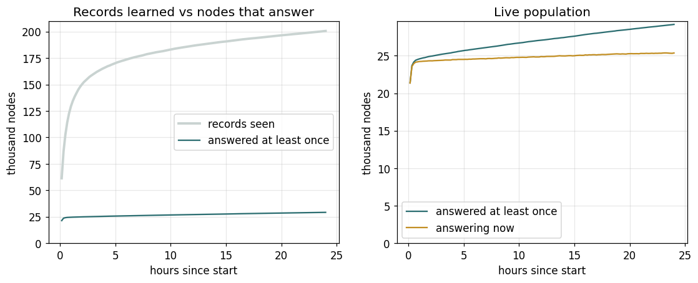
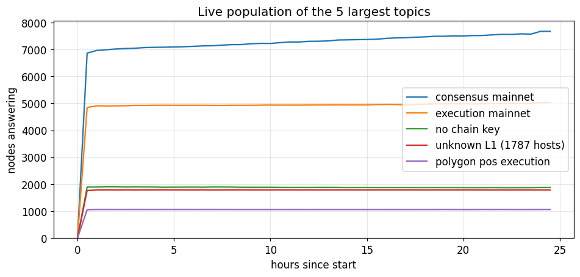
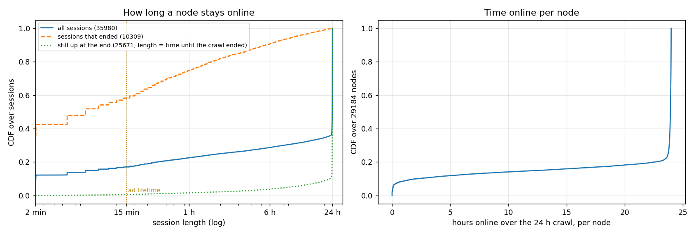
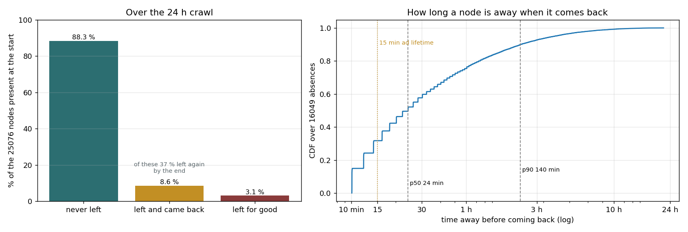
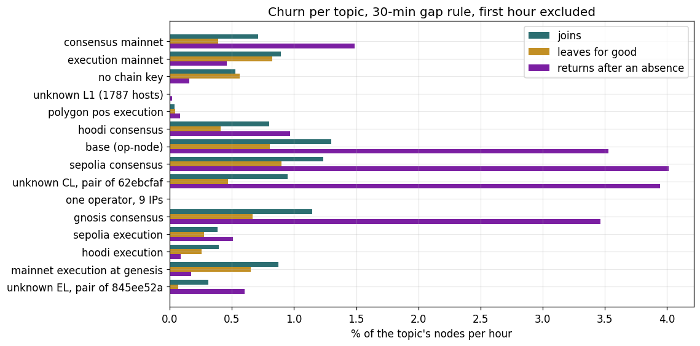
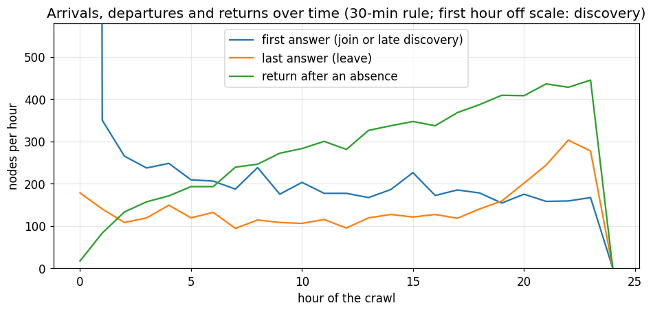

# Churn on the discv5 network, and what TopDisc takes from it

From the 24 hour crawl of 2026-09-18 (`docs/crawl-2026-09-18.md`): how nodes on the
public discv5 network come and go, and the two things the testbed and the protocol take
from it, the churn to replay and the ad lifetime.

## 1. The crawl

A crawler walked the discv5 network for 24 hours from 06:40 UTC on 18 September 2026,
learning records by random walks and pinging every node it had ever seen alive every two
minutes. A node is its discv5 identity; its chain is read from the record's fork field. A
session is a stretch of answered probes and ends when the node stays silent for 30 minutes
under the main rule, 10 minutes under the finer one used in section 4. The first hour is
discovery and is left out of the rates.

## 2. Who is there

*Left: records the random walk learned against nodes that ever answered a ping. Right:
nodes that ever answered against nodes answering at that moment.*

The walk learned about 200 000 records, of which 29 184 ever answered: most records in the
DHT point at nodes that are gone or unreachable. Of the responsive nodes about 25 000 answer
at any given moment; 24 585 were present in the first hour and 25 671 at the end.

*Nodes answering at each half hour, per topic.*

## 3. How long nodes stay online

*Left: length of every session, 30 minute rule; sessions still open when the crawl ended
are counted up to that moment. Right: hours online over the 24 hours, per node.*

The left panel counts sessions, the right one nodes. 71 % of all sessions were still open
when the crawl ended, most of them having run the whole day. The 29 % that ended are short:
42 % of them were a single answer, 58 % lasted under 15 minutes, nine in ten under six
hours. Per node, 80 % were online for the whole 24 hours and 10 % for under two hours.

## 4. Who leaves, who comes back

*Left: the nodes present in the first hour by what happened to them over the day, 10 minute
rule. Right: for the nodes that came back, how long they had been away.*

| of the 25 076 nodes present at the start | 10 minute rule | 30 minute rule |
|---|---:|---:|
| never left | 88.3 % | 90.8 % |
| left and came back at least once | 8.6 % | 5.9 % |
| of those, left again by the end | 37 % | 41 % |
| left for good | 3.1 % | 3.3 % |
| absences counted | 16 049 | 6 796 |
| time away, median / p90 | 24 min / 2 h 20 | 69 min / 4 h 24 |
| absences under 15 minutes | 32 % | none by construction |

The rule that ends a session sets what counts as leaving; either way nine in ten nodes
never leave, most of the churn is a minority that goes and returns, and a return usually
comes within the hour.

## 5. By chain

| chain | alive | never away | joins %/h | leaves %/h | returns %/h | median closed session |
|---|---:|---:|---:|---:|---:|---:|
| consensus mainnet | 8 456 | 91 % | 0.71 | 0.39 | 1.49 | 8 min |
| execution mainnet | 6 295 | 93 % | 0.90 | 0.83 | 0.46 | 6 min |
| no chain key | 2 207 | 94 % | 0.53 | 0.56 | 0.16 | 8 min |
| unknown L1, 1 787 hosts | 1 787 | 100 % | 0.00 | 0.00 | 0.02 | 99 min |
| polygon pos execution | 1 073 | 99 % | 0.04 | 0.04 | 0.09 | 44 min |
| hoodi consensus | 829 | 93 % | 0.80 | 0.41 | 0.97 | 18 min |
| base op-node | 807 | 90 % | 1.30 | 0.80 | 3.53 | 8 min |

Rates per hour from the second hour on, as a share of the chain's nodes, 30 minute rule.
Consensus-layer topics flicker three to eight times more than execution-layer ones; the
small execution chains barely move.

## 6. Over the day

*The first hour's arrivals are discovery, the last hour's departures include nodes that
would have returned after the crawl ended.*

Outside those the rates are flat. Consensus mainnet's returns climb from 0.4 to 2.2 % per
hour in step with the crawler's own timeout rate on known-alive nodes, which rose from 1.5
to 8 %: part of that chain's flicker is probe loss, and its first hours, about 0.5 % per
hour, are the safer estimate.

## 7. Caveats

- A restart with a new key counts as a leave and an arrival; about a fifth of the
  permanent leaves are followed within two hours by a new identity at the same address.
- The probe interval is two minutes, so shorter sessions read as a single answer and an
  absence shorter than the session rule is invisible.
- The crawler's timeouts on known-alive nodes rose over the day; the 30 minute rule absorbs
  most of it.
- One day of one crawl; weekly and seasonal patterns are not in it.

## 8. What TopDisc takes from it

**The churn the testbed replays.** Per topic: the join, leave and return rates, the
session-length and absence-length distributions, and the share of nodes that never leave,
fitted from the tables above into `scenarios/models/crawl-2026-09-18.json`
(`cmd/crawl/model.py`). A node gets a schedule drawn from its topic's fit; departures are
hard and a return brings the same identity, so an ad placed before an absence is still
valid if it has not expired. `session_churn.window_real_hours` compresses a day of this
churn into the run's window when a higher rate is wanted.

**Why a 15 minute ad lifetime.** The lifetime sets two things against each other.

- Stale ads. A departed node's ads stay in the caches until they expire, so the share of
  ads that are stale at any moment is about the departure rate times the lifetime. With
  leaves at 0.4 to 0.9 % per hour and returns at 0.5 to 3.5 % per hour, 15 minutes keeps
  stale ads around 0.2 to 1 % of the caches on the flickering chains and far less on the
  stable ones; 60 minutes would make that 1 to 4 %.
- Absences an ad survives. A third of absences are under 15 minutes, so those nodes come
  back with their ads valid and register nothing; the two thirds that stay away longer
  re-register on return, which is the right outcome since their ads had gone stale. A
  5 minute lifetime would turn almost every absence into a re-registration and triple the
  renewal traffic for a gain of under a percentage point of stale ads.
- Renewal cost. A registrant renews about 30 registrations per lifetime; at 15 minutes that
  is about 2 % of a node's bytes in every run measured, and it scales inversely with the
  lifetime.

15 minutes is where stale ads stay under one percent on the worst chains while renewals
stay a small share of traffic, and the absence distribution says shortening it further
buys little. The testbed's measurement at the replayed churn, 0.7 % of returned results
pointing at departed nodes, none older than a lifetime, agrees with the arithmetic.

Figures in `figures/churn-analysis/` come from `cmd/crawl/churn_figures.py` over the
crawl's `derived/gap30/sessions.csv` (sections 3) and `derived/gap10/sessions.csv`
(section 4); the others are the crawl report's.
