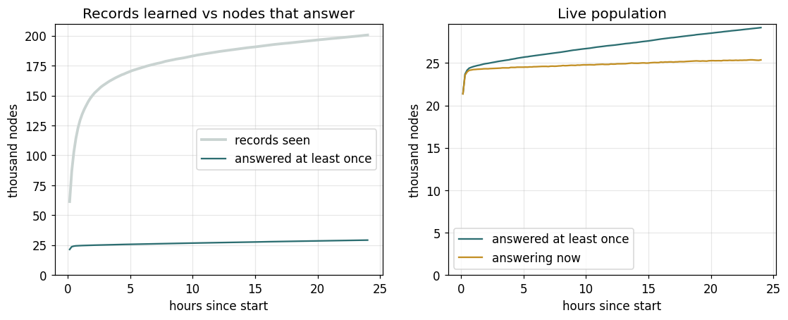
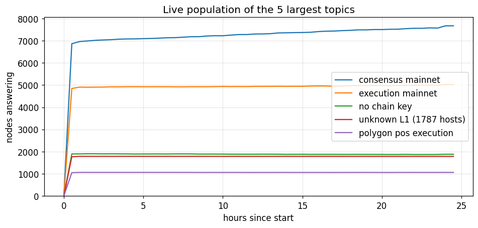
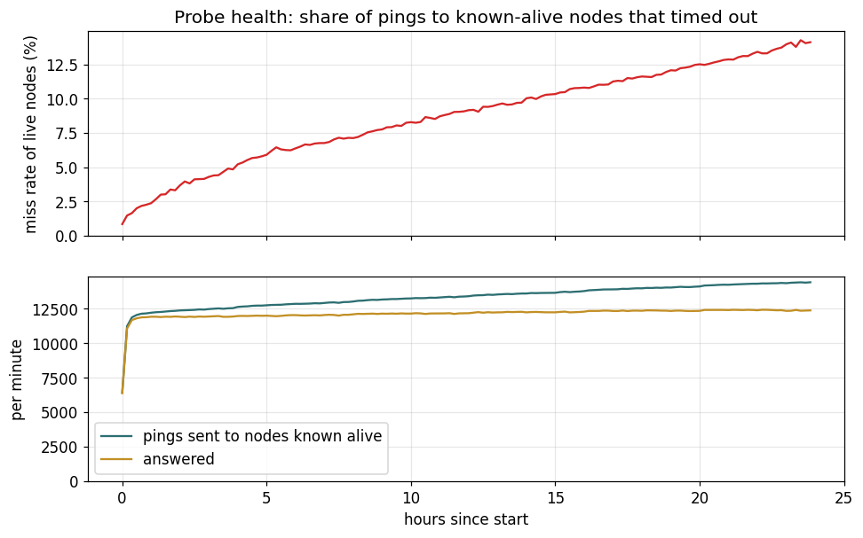
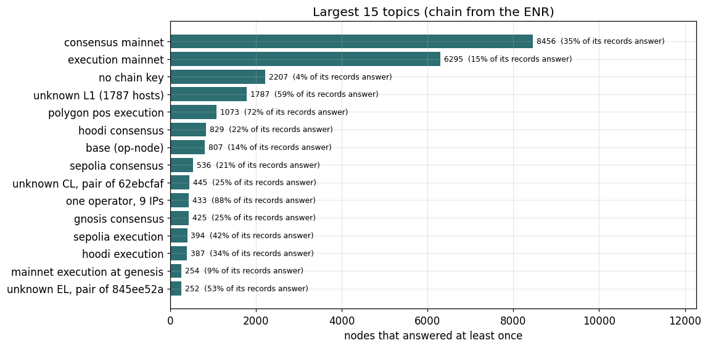
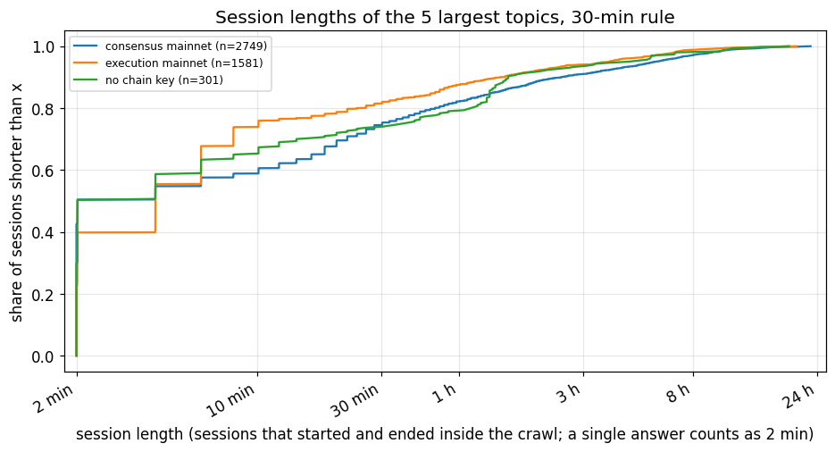
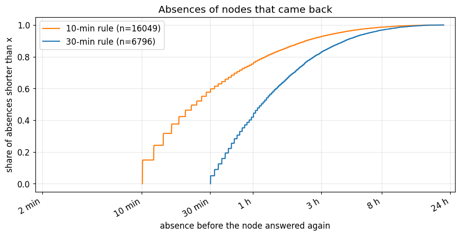
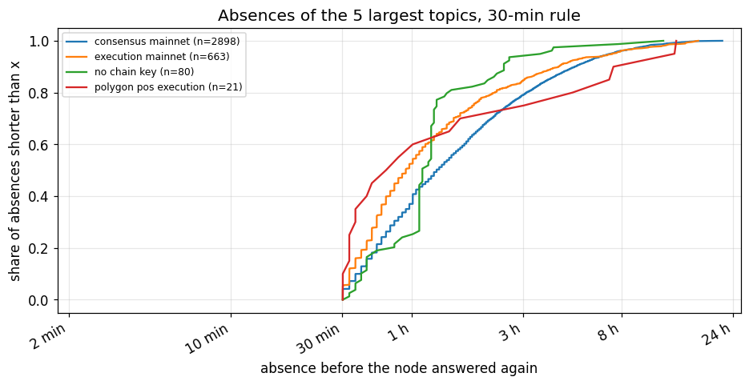
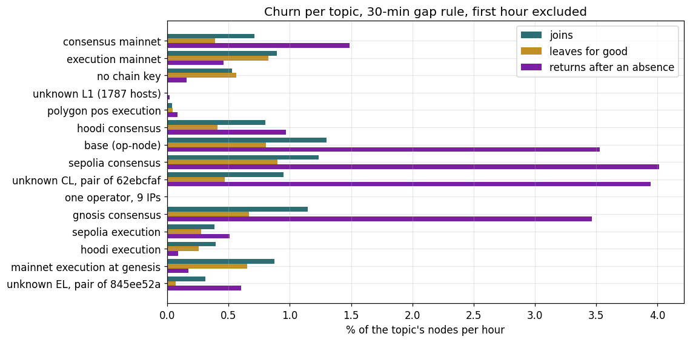
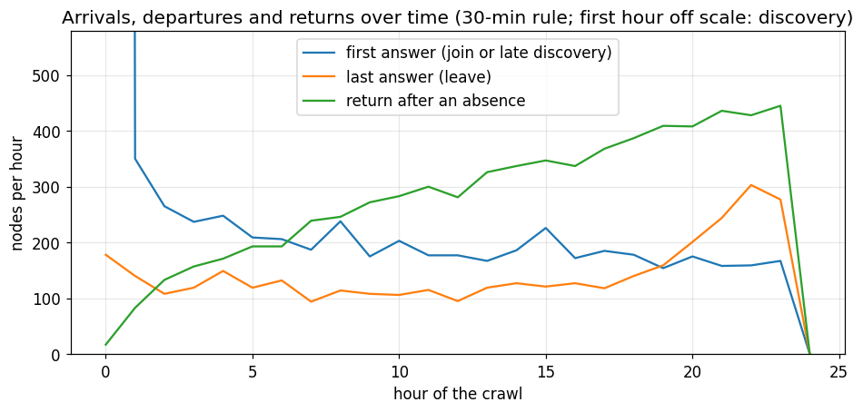
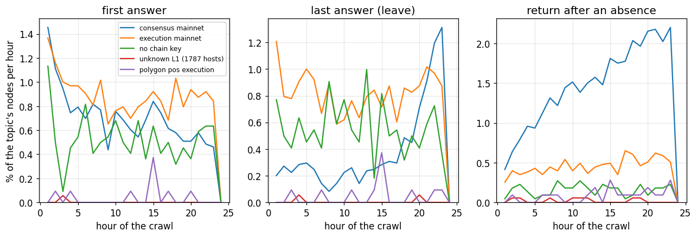

# 24 h discv5 crawl of 2026-09-18: population and churn

Frozen write-up of the crawl that feeds the testbed's topic and churn model
(`scenarios/models/crawl-2026-09-18.json`). Tool: `cmd/crawl` (PR #15);
model derivation: `cmd/crawl/model.py` (PR #16). Raw data (2.4 GB of
events with every ENR) and the derived session tables are on S3 at
`s3://datahop-testbed-data/crawl/2026-09-18/`, fetched by
`cmd/crawl/fetch.sh`.

24.0 h of continuous crawling and probing from an AWS host (a first attempt
from London was invalidated by the router's connection tracking, which
dropped most probe replies). 29 184 nodes answered at least once, 25 671
were answering at the end, over 455 chains. Every count and rate below is
over these nodes; the 200 653 records the DHT handed out, of which only
15 % ever answered, appear only in the reachability note of section 3.

Method in short: crawlers walk the DHT with random-target FINDNODE queries
and hand every new record to a prober; live nodes are pinged every 2 min,
new ones get three tries, dead ones are retried every 30 min. A node is
away after a gap of 30 min without an answer (`--down-after`); records of
the same node under a rotated key are merged by endpoint. The chain label
is the `eth` fork hash, the `eth2` fork digest or the `opstack` chain id
in the node's own record.

24.0 h of continuous crawling and probing. 29184 nodes answered at least once, 25671 were answering at the end, over 455 chains. Every count and rate below is over these nodes; the 200653 records the DHT handed out (of which only 15 % answered) appear only in the reachability note of section 3.

## 1. Population

### 01_population

*Left: records learned by the random walk against nodes that ever answered a ping. Right: nodes that ever answered against nodes answering at that moment (2-min probes). The first hour is discovery.*

### 01b_population_topics

*Nodes answering at each half hour, per topic, from the sessions (30-min rule).*

## 2. Probe health

### 02_probe_health

> The timeout share on known-alive nodes rose from 1.5 % to ~8 % over the day with weak clustering; with the 30-min rule it produces few false leaves, but see 07b.

*17,481,898 answers and 1,722,656 timeouts from nodes that had answered before (9.0 %). Top: the share of those pings that timed out. Bottom: pings sent and answered per minute; every node that ever answered is pinged every 2 minutes. A session ends only after 10 or 30 minutes without an answer, so isolated timeouts do not count as leaves.*

## 3. Topics

### 03_topics

> Chain ids are the fork hash (eth), the fork digest (eth2) or the OP-stack chain id (op) from each node's ENR; names come from recomputing the hash for known networks or from co-hosting. eth:22d523b2 is Polygon PoS execution at its Prague fork (block 73440256); eth:d38cc282 is BSC at the Pasteur fork; eth:cfca387c, eth:715477e3 and eth:71c457cd are the execution sides of Gnosis, Lukso and Chiado (they share hosts with those consensus nodes); mainnet consensus 8c9f62fe is the Fulu digest with the blob-schedule entry at epoch 419072 (21 blobs), Sepolia 74d01459 likewise (epoch 275712). Still unnamed: eth:4be0e445 (1787 nodes on 1787 hosts, geth-derived, matches no fork of mainnet, Sepolia, Holesky, Hoodi, Classic, EthereumPoW, BSC, Polygon, Gnosis, Scroll or Ronin), eth2:845ee52a with eth:62ebcfaf (one network's consensus and execution sides on 178 shared hosts) and eth:9d4df79a (433 nodes on 9 IPs, one operator).

*455 chains with at least one answering node: 5 with 1000 or more, 23 with 100 or more, 110 with 10 or more. The percentage is the share of the chain's DHT records that answer a stranger (the rest are NATed, stale, or rotated identities).*

| chains ranked by size | chains | nodes | share |
|---|---:|---:|---:|
| 1–5 (8456…1073 nodes) | 5 | 19818 | 67.9 % |
| 6–22 (829…100 nodes) | 17 | 5751 | 19.7 % |
| 23–110 (100…10 nodes) | 88 | 2744 | 9.4 % |
| 111–455 (9…1 nodes) | 345 | 871 | 3.0 % |

| chain | name | nodes | of its records answering | cumulative share |
|---|---|---:|---:|---:|
| `eth2:8c9f62fe` | consensus mainnet | 8456 | 35 % | 29 % |
| `eth:07c9462e` | execution mainnet | 6295 | 15 % | 51 % |
| `none` | no chain key | 2207 | 4 % | 58 % |
| `eth:4be0e445` | unknown L1 (1787 hosts) | 1787 | 59 % | 64 % |
| `eth:22d523b2` | polygon pos execution | 1073 | 72 % | 68 % |
| `eth2:c6ecb76c` | hoodi consensus | 829 | 22 % | 71 % |
| `op:8453` | base (op-node) | 807 | 14 % | 74 % |
| `eth2:74d01459` | sepolia consensus | 536 | 21 % | 75 % |
| `eth2:845ee52a` | unknown CL, pair of 62ebcfaf | 445 | 25 % | 77 % |
| `eth:9d4df79a` | one operator, 9 IPs | 433 | 88 % | 78 % |
| `eth2:3237dab6` | gnosis consensus | 425 | 25 % | 80 % |
| `eth:268956b6` | sepolia execution | 394 | 42 % | 81 % |
| `eth:23aa1351` | hoodi execution | 387 | 34 % | 82 % |
| `eth:fc64ec04` | mainnet execution at genesis (unsynced) | 254 | 9 % | 83 % |
| `eth:62ebcfaf` | unknown EL, pair of 845ee52a | 252 | 53 % | 84 % |

## 4. Sessions

### 04_session_length

*Only sessions with both ends inside the crawl, so these are the sessions of nodes that churn; the majority of nodes never closed a session (see the stay column in section 6). A quarter to two fifths of these sessions are a single answer: the node was reachable for one probe and silent again for 30 minutes or more.*

## 5. Absences

### 05_absence_length

*Only nodes that left and answered again: the silence between two of their sessions. Nodes that left for good are not here (they are the leaves in section 6). The rule that ends a session sets the floor: with the 10-min rule shorter absences count as leaves.*

### 05b_absence_topics

*The same, per topic.*

## 6. Churn per topic

### 06_churn_per_topic

> Consensus-layer topics flicker 3–8x more than execution-layer ones; the small execution chains barely move. scenarios/models/crawl-2026-09-18.json reproduces this per topic.

| chain | alive | at start | at end | start nodes never away | joins %/h | leaves %/h | returns %/h (30 min) | returns %/h (10 min) | median closed session |
|---|---:|---:|---:|---:|---:|---:|---:|---:|---:|
| `eth2:8c9f62fe` consensus mainnet | 8456 | 7072 | 7675 | 91 % | 0.71 | 0.39 | 1.49 | 2.68 | 8 min |
| `eth:07c9462e` execution mainnet | 6295 | 4999 | 5028 | 93 % | 0.90 | 0.83 | 0.46 | 1.72 | 6 min |
| `none` no chain key | 2207 | 1939 | 1882 | 94 % | 0.53 | 0.56 | 0.16 | 0.52 | 8 min |
| `eth:4be0e445` unknown L1 (1787 hosts) | 1787 | 1786 | 1785 | 100 % | 0.00 | 0.00 | 0.02 | 0.10 | 99 min |
| `eth:22d523b2` polygon pos execution | 1073 | 1064 | 1062 | 99 % | 0.04 | 0.04 | 0.09 | 0.45 | 44 min |
| `eth2:c6ecb76c` hoodi consensus | 829 | 676 | 750 | 93 % | 0.80 | 0.41 | 0.97 | 2.21 | 18 min |
| `op:8453` base (op-node) | 807 | 566 | 651 | 90 % | 1.30 | 0.80 | 3.53 | 10.10 | 8 min |
| `eth2:74d01459` sepolia consensus | 536 | 384 | 424 | 90 % | 1.23 | 0.90 | 4.02 | 6.63 | 0 min |
| `eth2:845ee52a` unknown CL, pair of 62ebcfaf | 445 | 348 | 397 | 93 % | 0.95 | 0.47 | 3.95 | 8.67 | 4 min |
| `eth:9d4df79a` one operator, 9 IPs | 433 | 433 | 433 | 100 % | 0.00 | 0.00 | 0.00 | 0.33 | 0 min |
| `eth2:3237dab6` gnosis consensus | 425 | 313 | 357 | 89 % | 1.15 | 0.66 | 3.47 | 5.89 | 2 min |
| `eth:268956b6` sepolia execution | 394 | 359 | 368 | 97 % | 0.39 | 0.28 | 0.51 | 2.58 | 44 min |
| `eth:23aa1351` hoodi execution | 387 | 352 | 363 | 96 % | 0.39 | 0.26 | 0.09 | 1.26 | 198 min |
| `eth:fc64ec04` mainnet execution at genesis (unsynced) | 254 | 203 | 214 | 91 % | 0.87 | 0.65 | 0.17 | 0.36 | 79 min |
| `eth:62ebcfaf` unknown EL, pair of 845ee52a | 252 | 234 | 248 | 97 % | 0.31 | 0.07 | 0.60 | 4.02 | 44 min |

All topics: 29184 nodes ever alive, 24585 present in the first hour, 25671 at the end. A node is its discv5 ID: a restart with a new key counts as a leave plus an arrival (about a fifth of the permanent leaves are followed within 2 h by a new ID at the same IP:port).

## 7. Events over time

### 07_events_over_time

*The first hour's first answers are discovery, not arrivals, and run off the scale; the last hour's departures include nodes that would have returned after the crawl ended.*

### 07b_events_topics

> Consensus mainnet's returns climb from 0.4 to 2.2 %/h over the day while its leaves stay flat and the crawler's timeouts climb the same way: a probe-side artifact on that topic, not churn.

*The same per topic, as a share of the topic's nodes, from hour 1. Returns on consensus mainnet rise through the day in step with the crawler's timeout rate (section 2), so part of that topic's flicker is probe loss rather than nodes; its first hours (0.5 %/h) are the safer estimate.*
