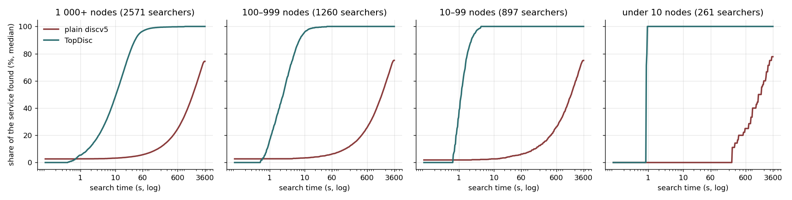
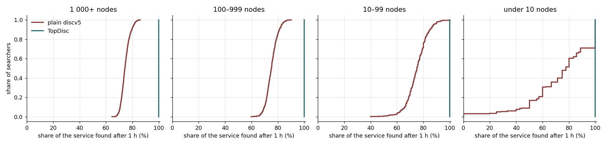
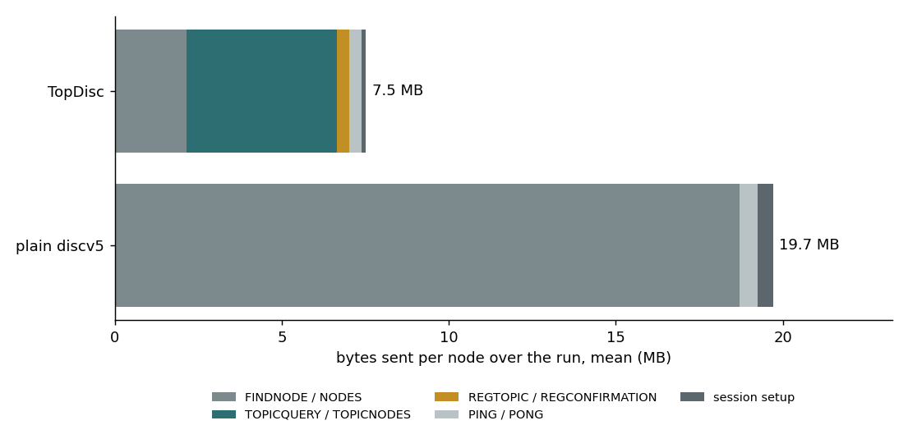
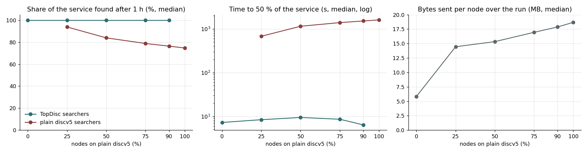

# TopDisc against plain discv5

A node that needs peers of one service, such as one chain, has to find nodes that provide it. Plain discv5 has no search for a service. TopDisc adds one. This document compares the two on the same simulated network.

| | |
|---|---|
| backend | simnet, 5 000 nodes |
| workload | the 100 largest chains of the 2026-09-18 crawl |
| search | 1 h, every node searches its own service |
| runs | 8: all TopDisc, all plain discv5, 25 / 50 / 75 / 90 % plain, and the first two again with churn |
| result | TopDisc finds every provider in seconds; plain discv5 finds 75 % in 1 h |

## Summary

| Topic size | Plain discv5: found after 1 h / time to 50 % / time to 90 % | TopDisc: found after 1 h / time to 50 % / time to 90 % |
|---|---|---|
| 1 000+ nodes | 74 % / 27 min / not reached | 100 % / 10 s / 37 s |
| 100–999 nodes | 75 % / 26 min / not reached | 100 % / 2.4 s / 7.1 s |
| 10–99 nodes | 75 % / 26 min / 50 min | 100 % / 1.1 s / 2.2 s |
| under 10 nodes | 78 % / 21 min / 37 min | 100 % / 0.9 s / 0.9 s |

Medians over searchers. "Not reached" means that fewer than half of the searchers found 90 % of their service in the hour.

- TopDisc found every provider of every service. Plain discv5 found three quarters. Only 3.7 % of the searchers in services of 10 to 99 nodes, and almost none in larger services, found 90 %.
- TopDisc reaches half of a service 150 to 1 500 times faster, and more so for smaller services.
- TopDisc nodes sent 5.8 MB each at the median over the run, plain discv5 nodes 18.7 MB.
- In mixed networks, TopDisc nodes still found every TopDisc node of their service in seconds, down to 10 % TopDisc nodes.

## 1. The problem

In plain discv5 a node can only ask for nodes close to an ID. It cannot ask for nodes of a service. A node that needs peers of its chain therefore walks the DHT with random targets and keeps the nodes whose record names its chain. Each walk returns nodes from one part of the ID space, so the node must cover the whole network to find all providers. Clients that use discv5 find their peers in this way today.

TopDisc lets a node register its service on registrars near the hash of the service, and lets other nodes ask those registrars for the service directly.

## 2. Scenario

| | Plain discv5 run | TopDisc run |
|---|---|---|
| nodes | 5 000, all plain discv5 | 5 000, all TopDisc |
| services | 100 chains with their crawl shares; the largest has 2 892 nodes, 27 have 10 or fewer | the same assignment |
| node addresses | drawn from the crawl's address distribution | the same |
| how a node advertises its service | an entry in its node record | registration on registrars, plus the same record entry |
| how a node searches | random-target DHT lookups, keeping nodes whose record names its service | TopDisc topic search: adaptive, floor 8, aux radius 1, results mixed over 5 registrars |
| what counts as found | every node of its service | every node of its service |
| timeline | 3 min boot, 15 min start window, 15 min wait, 1 h search | the same |
| fork | `v1.17.2-testbed.13` | the same |

There is no churn and no connection model: every node runs one continuous search for the whole hour and keeps every new result. Simnet latency is 30 ms per link with no loss. The two runs use the same seed, so the services, the addresses and the start times are the same.

## 3. Results

### Share of the service found over time

*Median share of its service each searcher had found, against search time (log scale), by service size. 5 000 nodes, 1 h search.*

TopDisc finds all of a small service in about one second and all of a large one in about one minute. Plain discv5 starts from the few providers already in its routing table and then grows slowly. After one hour it has about three quarters of its service, at all sizes.

Plain discv5 does the same work for every service: one walk covers the network, whatever the service is. That is why its curve has the same shape for a service of 2 892 nodes and for one of 5. A service with fewer than 10 nodes is often not in the routing table at the start, so its first result takes 3.8 min at the median.

### Share of the service found at the end

*Share of its service each searcher had found after 1 h, as a distribution over searchers, by service size.*

| Topic size | Searchers | Plain discv5: all found | TopDisc: all found |
|---|---|---|---|
| 1 000+ nodes | 2 571 | 0 % | 100 % |
| 100–999 nodes | 1 260 | 0 % | 100 % |
| 10–99 nodes | 897 | 0.4 % | 100 % |
| under 10 nodes | 261 | 29 % | 100 % |

### Cost

*Mean bytes sent per node over the whole run, by message type.*

| | Plain discv5 | TopDisc |
|---|---|---|
| bytes sent per node, median / p95 / max | 18.7 / 27.8 / 140 MB | 5.8 / 17.9 / 86 MB |
| requests per search over 1 h, median | 428 DHT lookups, each several FINDNODE requests | 945 to 3 341 TOPICQUERY requests, more for larger services |
| main traffic | FINDNODE and NODES | TOPICQUERY and TOPICNODES |

TopDisc nodes still send some FINDNODE traffic, to keep their routing tables and to find registrars. Registration (REGTOPIC) is a small share of their bytes.

The TopDisc request count grows with the size of the service, because a larger service has more providers to collect. A plain discv5 node sends the same number of lookups in all cases, because it keeps walking until the hour ends.

### With churn

The same pair again, with each node leaving and returning as the nodes of its chain did in the crawl, in real time, and a 90-minute search. A node that is away stops its search and resumes it when it returns. The share found counts every node of the service, also the nodes that are away at the end, so 100 % is often not reachable.

| Topic size | Plain discv5: found / to 50 % / to 90 % | TopDisc: found / to 50 % / to 90 % |
|---|---|---|
| 1 000+ nodes | 87 % / 27 min / 85 min (10 % of searchers) | 99.9 % / 11 s / 39 s |
| 100–999 nodes | 88 % / 26 min / 82 min (19 %) | 100 % / 2.4 s / 7.3 s |
| 10–99 nodes | 88 % / 26 min / 76 min (36 %) | 100 % / 1.1 s / 2.3 s |
| under 10 nodes | 89 % / 23 min / 55 min (49 %) | 100 % / 0.9 s / 0.9 s |

| | Plain discv5 | TopDisc |
|---|---|---|
| bytes sent per node over the run, median | 28.4 MB | 8.6 MB |

Churn does not slow TopDisc: the times are the same as without churn. Plain discv5 found more than in the 1-hour run without churn (87 % against 75 %) because it had 30 minutes more. TopDisc nodes sent 8.6 MB, a third of the plain discv5 nodes, as without churn.

### Mixed networks

A network does not switch to TopDisc at once. Four more runs give a share of the nodes of every service plain discv5 and the rest TopDisc: 25 %, 50 %, 75 % and 90 % plain. A TopDisc searcher counts the TopDisc nodes of its service, because those are the ones that register. A plain searcher counts every node of its service, because every node carries the service in its record.

*Five-thousand-node networks with 0, 25, 50, 75, 90 and 100 % of the nodes on plain discv5. Left and middle: medians over the searchers of each kind. Right: median over all nodes.*

| Nodes on plain discv5 | TopDisc searchers: found / time to 50 % / time to 90 % | Plain searchers: found / time to 50 % | Bytes sent per node, median |
|---|---|---|---|
| 0 % | 100 % / 7.2 s / 25 s | | 5.8 MB |
| 25 % | 100 % / 8.4 s / 28 s | 94 % / 11 min | 14.4 MB |
| 50 % | 100 % / 9.4 s / 26 s | 84 % / 19 min | 15.3 MB |
| 75 % | 100 % / 8.6 s / 19 s | 79 % / 23 min | 16.9 MB |
| 90 % | 100 % / 6.4 s / 12 s | 76 % / 25 min | 17.9 MB |
| 100 % | | 75 % / 27 min | 18.7 MB |

TopDisc searchers keep finding every TopDisc node of their service, in seconds, at every share. With 90 % of the nodes on plain discv5 a service has ten times fewer TopDisc nodes, and the search still finds all of them in about 12 s.

Plain searchers find more when more of the network runs TopDisc: 94 % with 25 % plain, 75 % with all plain. These runs do not show the cause. One possibility is that the TopDisc nodes send fewer lookups, so the walks of the plain nodes run in a less loaded network.

The bytes per node grow as soon as plain nodes join: from 5.8 MB with no plain nodes to 14.4 MB with 25 %. The random walks of the plain nodes reach every node, so TopDisc nodes also spend bytes answering them.

## 4. Conclusions

1. TopDisc finds every provider of every service in this network. Plain discv5 finds about 75 % in one hour.
2. TopDisc reaches half of a service 150 times faster for the largest services and about 1 500 times faster for services under 100 nodes.
3. TopDisc nodes send about one third of the bytes of plain discv5 nodes.
4. Plain discv5 is worst for small services: they are rarely in the routing table, and a random walk finds them only by chance.
5. With crawl churn TopDisc keeps the same speed and finds 99.9 to 100 % of each service at the median.
6. In a mixed network TopDisc nodes still find every TopDisc node of their service in seconds, down to 10 % TopDisc nodes. Plain nodes find more of their service the more nodes run TopDisc.

## 5. Limits

- One run of each, in simnet. The AWS and Grid'5000 runs of the same two scenarios are prepared (`aws-crawl-1k-discv5`, `g5k-crawl-5k-discv5`) but not run.
- With churn a node writes its results when the run ends; a node away at that time has no results. This affects both runs the same way.
- The plain discv5 searcher keeps walking for the whole hour. A client that stops after a fixed number of peers sends fewer lookups and finds fewer providers.
- Two of the mixed runs per share would show how much of the change in the plain searchers is noise; each share ran once.
